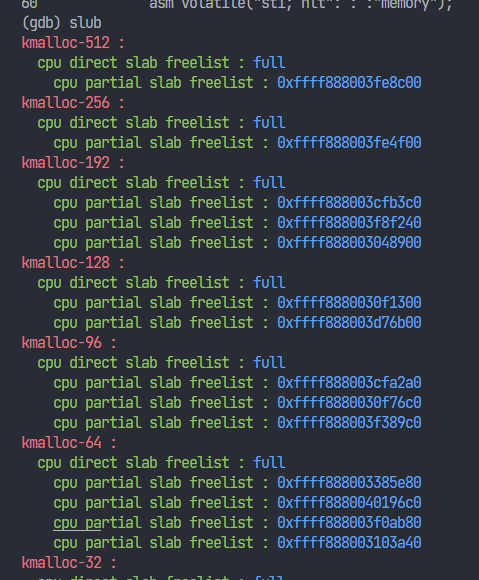
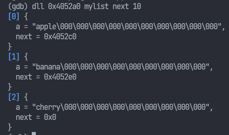

all pwn plugins 


# examples

```shell
slub
```



TODO:
- only complete pre-cpu part and restrict to display only `kmalloc-{num}`.
- not achieve list chain bcoz deref the freelist will 
- don't considering frozen mechanism

```shell
dll 0x4052a0 mylist next 10
```
deref custom linked list


TODO:
- configurable options